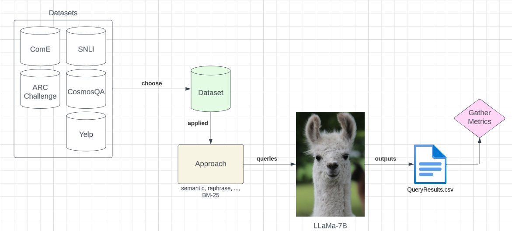

# A Survey of Improving In-Context Learning for LLMs

## Authors
* Daniel Hassler (hassledw@vt.edu)
* Hoang Anh Just (just@vt.edu)
* Taylor Neller (taylor02@vt.edu)
* Jianan Nie (jianan@vt.edu) 

## Problem Introduction
LLM models such as ChatGPT have the ability to learn in-context (ICL). Given a few demonstrations, these types of LLMs can successfully generate related content in that problem domain for specific tasks. One problem in-context learning exhibits, regarding accurate results, is its dependence on the quality of demonstration examples and prompt structure. In this work, we survey different ICL method approaches and explore results.

## Datasets
**SNLI** 
```
Name: Natural Language Inference
Link: https://huggingface.co/datasets/KaiLv/UDR_SNLI
Description: Natural language inference classification dataset
Labels: 0-2, where 0 is “entailment”, 1 is “inconclusive”, 2 is “contradiction”
```
**CosmosQA** 
```
Name: Commonsense-based Reading Comprehension
Link: https://huggingface.co/datasets/cosmos_qa
Description: reading comprehension QA dataset.
Labels: 0-3, each representing the index to each choice.
```
**ARC Challenge** 
```
Name: AI2 Reasoning Challenge 
Link: https://huggingface.co/datasets/ai2_arc
Description: multiple choice reasoning dataset consisting of “challenging” grade school level questions.
Labels: choices A, B, C, or D.
```
**ComE**
```
Name: Commonsense Explanation
Link: https://huggingface.co/datasets/KaiLv/UDR_ComE
Description: A multi-label classification dataset aimed for commonsense reasoning.
Labels: choices A, B, or C.
```
**Yelp**
```
Name: Yelp
Link: https://huggingface.co/datasets/KaiLv/UDR_Yelp
Description: A multi-label sentiment classification dataset with 38,000 entries of Yelp reviews.
Labels: 0-4, where 0 is “very negative”, 2 is “neutral”, and 4 is “very positive”.
```

## LLM
We chose [LLaMa](https://huggingface.co/meta-llama/Llama-2-7b-chat-hf) for our evaluation LLM, as this model was readily available online and small enough to be downloadable in our environment. This model has 7 billion parameters. Although we use a smaller LLM, we speculate that larger variants of LLaMa or different LLMs entirely (GPT-4, GPT-3) would have different/higher level of preformance.

Below, is our high level diagram showing how we incorporated LLaMa, our datasets, and our approaches:

